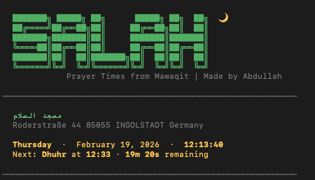

# salah-cli

A command-line tool that displays daily prayer times (Adhan and Iqama) sourced from [Mawaqit](https://mawaqit.net) mosques. Designed for quick, at-a-glance access to prayer schedules directly from the terminal.

<p align="center">
  
</p>

## Features

- Search and save your local mosque by city or name
- View today's Adhan and Iqama times
- Weekly and monthly prayer calendars

## Requirements

- Node.js 18 or later
- npm

## Installation

Clone the repository and install dependencies:

```
git clone the repo
cd salah-cli
npm install
```

To make the `salah` command available globally:

```
npm link
```

## Usage

### Interactive mode

```
salah
```

Opens the main menu with a live clock, next prayer countdown, and access to all views.

### Quick commands

```
salah -w          # Weekly prayer calendar
salah -a          # Monthly prayer calendar
```

### Mosque configuration

```
salah config              # Search and select a mosque
salah config -c "Berlin"  # Search mosques in a specific city
salah reset               # Clear saved mosque
```

## How it works

On first run, the app detects your country via IP geolocation and prompts you to search for a mosque. Once selected, the mosque is saved locally and prayer times are fetched from the Mawaqit API on each use.

The daily view shows Adhan times alongside Iqama times (where available). The weekly and monthly views pull from the mosque's published calendar.


## License
MIT
